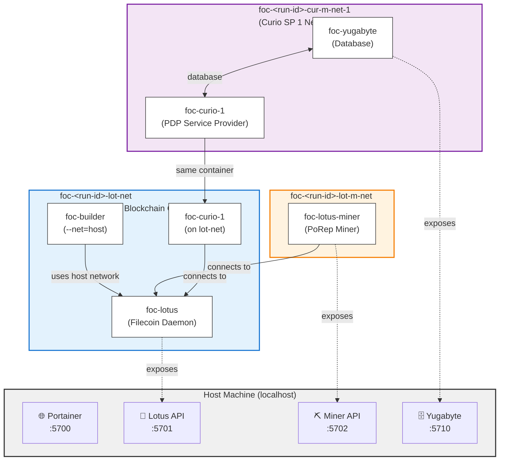

# Advanced Guide: foc-devnet

This guide covers advanced usage, internal architecture, and operational details of foc-devnet.

---

## Commands Reference

### `init`
Initializes foc-devnet by downloading repositories, building Docker images, and preparing the environment.

```bash
foc-devnet init [OPTIONS]
```

**Options:**
- `--curio <SOURCE>` - Curio source location
- `--lotus <SOURCE>` - Lotus source location
- `--filecoin-services <SOURCE>` - Filecoin Services source location
- `--synapse-sdk <SOURCE>` - Synapse SDK source location
- `--yugabyte-url <URL>` - Yugabyte download URL
- `--yugabyte-archive <PATH>` - Local Yugabyte archive file
- `--proof-params-dir <PATH>` - Local proof params directory
- `--force` - Force regeneration of config file
- `--rand` - Use random mnemonic instead of deterministic one

**Source Format:**
- `gittag:v1.0.0` - Specific git tag (uses default repo)
- `gittag:https://github.com/user/repo.git:v1.0.0` - Tag from custom repo
- `gitcommit:abc123` - Specific git commit
- `gitbranch:main` - Specific git branch
- `local:/path/to/repo` - Local directory

**Example:**
```bash
foc-devnet init \
    --lotus local:/home/user/lotus \
    --curio gitbranch:pdpv0 \
    --force
```

### `build`
Builds Filecoin components in Docker containers.

> **Note:** This command must be run after `init` to ensure Docker images and environment are prepared.

```bash
foc-devnet build lotus [PATH] [--output-dir <DIR>]
foc-devnet build curio [PATH] [--output-dir <DIR>]
```

**Example:**
```bash
foc-devnet build lotus
foc-devnet build curio /path/to/custom/curio --output-dir ~/bins
```

### `start`
Starts the local Filecoin network cluster.

> **Note:** This command should be run after `build` of `lotus` and `curio` to ensure binaries are available.

```bash
foc-devnet start [OPTIONS]
```

**Options:**
- `--volumes-dir <DIR>` - Custom docker volumes directory
- `--run-dir <DIR>` - Custom run-specific data directory
- `--parallel` - **⚡ Run steps in parallel for ~40% faster startup (recommended)**
- `--notest` - Skip end-to-end tests

**Recommended for faster startup:**
```bash
foc-devnet start --parallel
```

**Skip tests during development:**
```bash
foc-devnet start --parallel --notest
```

> **💡 Pro Tip:** Use `--parallel` by default! It runs independent steps concurrently (contract deployments, database startup, etc.) while respecting dependencies. This can reduce startup time from ~5 minutes to ~3 minutes.

**After successful start:**
- Portainer UI available at http://localhost:5700 (uses first port in configured range)
- Use Portainer to monitor containers, view logs, and debug issues
- All container names include the run ID for easy identification

### `stop`
Stops all running containers and cleans up Docker networks.

```bash
foc-devnet stop
```

**What it does:**
- Stops containers in reverse order (Curio → Yugabyte → Lotus-Miner → Lotus)
- Removes containers to ensure clean state
- Deletes Docker networks
- Preserves Portainer for persistent access
- Clears run ID

### `status`
Shows the current status of the foc-devnet system.

```bash
foc-devnet status
```

Displays:
- Current run ID
- Container states
- Network information
- Port allocations

### `version`
Shows version information.

```bash
foc-devnet version
```

---

## Configuration System

### Config File Location

```
~/.foc-devnet/config.toml
```

### Config Structure

```toml
# Port range for dynamic allocation
# foc-devnet uses a contiguous range of ports to avoid conflicts with other
# services on your machine. All components (Lotus, Curio SPs, Yugabyte, etc.)
# dynamically allocate ports from this range. Using a dedicated range ensures:
# - No conflicts with system services (MySQL, PostgreSQL, etc.)
# - Easy firewall configuration (just open one range)
# - Port availability can be validated before starting
port_range_start = 5700
port_range_count = 100

# Service Provider configuration
approved_pdp_sp_count = 1  # SPs registered and approved in registry
active_pdp_sp_count = 1    # Total SPs actually running

# Yugabyte database
yugabyte_download_url = "https://software.yugabyte.com/releases/2.25.1.0/..."

# Component sources
[lotus]
url = "https://github.com/filecoin-project/lotus.git"
tag = "v1.34.0"

[curio]
url = "https://github.com/filecoin-project/curio.git"
branch = "pdpv0"

[filecoin_services]
url = "https://github.com/FilOzone/filecoin-services.git"
tag = "v1.0.0"

[multicall3]
url = "https://github.com/mds1/multicall3.git"
branch = "main"

[synapse_sdk]
url = "git@github.com:FilOzone/synapse-sdk.git"
tag = "synapse-sdk-v0.36.1"
```

### Configuration Parameters

| Parameter | Type | Default | Description |
|-----------|------|---------|-------------|
| `port_range_start` | u16 | 5700 | Starting port for contiguous port range |
| `port_range_count` | u16 | 100 | Number of ports in the range |
| `approved_pdp_sp_count` | usize | 1 | Number of approved service providers |
| `active_pdp_sp_count` | usize | 1 | Number of running service providers |
| `yugabyte_download_url` | string | (URL) | Yugabyte database tarball URL |

**Constraints:**
- `approved_pdp_sp_count` ≤ `active_pdp_sp_count` ≤ `MAX_PDP_SP_COUNT` (5)

### Editing Config

```bash
# Edit manually
vim ~/.foc-devnet/config.toml

# Or use init --force to regenerate
foc-devnet init --force
```

---

## Directory Structure

```
~/.foc-devnet/
├── config.toml                      # Main configuration file
├── bin/                             # Compiled binaries (lotus, curio)
├── code/                            # Cloned repositories, or symlinks
│   ├── lotus/                       # Lotus source code
│   ├── curio/                       # Curio source code
│   ├── filecoin-services/           # FOC smart contracts
│   ├── multicall3/                  # Multicall3 contracts
│   └── synapse-sdk/                 # Synapse SDK
├── docker/
│   └── volumes/
│       ├── cache/                   # Shared cache (proof params, etc.)
│       │   └── filecoin-proof-parameters/
│       └── run-specific/            # Run-isolated volumes
│           └── <run-id>/            # Each run has its own volumes
│               ├── lotus-data/      # Lotus blockchain data
│               ├── lotus-miner-data/
│               ├── yugabyte-data/
│               ├── curio-1/         # First Curio SP
│               ├── curio-2/         # Second Curio SP (if active)
│               └── ...
├── keys/                            # BLS keys (genesis/mnemonic)
│   ├── mnemonic.txt                 # Seed phrase
│   └── genesis/                     # Genesis block keys
├── logs/                            # Container logs
├── run/                             # Run-specific execution data
│   └── <run-id>/                    # e.g., 26jan02-1430_ZanyPip/
│       ├── setup.log                # Startup execution log
│       ├── version.txt              # Component versions
│       ├── contract_addresses.json  # Deployed contracts
│       ├── step_context.json        # Step state (addresses, etc.)
│       ├── foc_metadata.json        # FOC service metadata
│       └── pdp_sps/
│           ├── 1.provider_id.json   # First SP provider ID
│           ├── 2.provider_id.json   # Second SP provider ID
│           └── ...
├── state/                           # Global state
│   ├── current_run_id.txt           # Current active run
│   └── latest -> ../run/<run-id>/   # Symlink to latest run
└── tmp/                             # Temporary files
```

### Key Files

**`contract_addresses.json`** - Deployed smart contract addresses:
```json
{
  "MockUSDFC": "0x1234...",
  "Multicall3": "0x5678...",
  "PDPVerifier": "0x9abc...",
  "ServiceProviderRegistry": "0xdef0...",
  "FilecoinWarmStorageService": "0x1122..."
}
```

**`step_context.json`** - Shared state between steps, useful for figuring out what happened, what commands were run:
```json
{
  "deployer_mockusdfc_eth_address": "0xabcd...",
  "deployer_foc_eth_address": "0xef01...",
  "mockusdfc_contract_address": "0x1234...",
  "foc_lot_api_addr": "/ip4/127.0.0.1/tcp/1234/http",
  "pdp_1_provider_id": "f01234"
}
```

**`foc_metadata.json`** - FOC service configuration:
```json
{
  "service_name": "FOC DevNet Warm Storage",
  "service_description": "Warm storage service...",
  "mockusdfc_address": "0x1234...",
  "warm_storage_service_address": "0x5678..."
}
```

---

## Resetting the System

### Normal Start Behavior

**What happens on `start`:**
- Stops any running containers from previous runs
- Creates a NEW run with a unique run ID
- Previous run data is **preserved** for historical reference and debugging
- Each run is completely isolated by its run ID

```bash
foc-devnet start  # Creates new run, preserves old ones
```

**Why preserve old runs?**
- **Debugging:** Compare logs and state between runs
- **Historical reference:** Track what happened in previous tests
- **No conflicts:** Run IDs ensure complete isolation
- **Disk management:** You control cleanup manually

### Manual Cleanup

**Delete specific old run:**
```bash
# Stop cluster first
foc-devnet stop

# Delete specific run by run ID
rm -rf ~/.foc-devnet/run/26jan01-1200_OldRun
rm -rf ~/.foc-devnet/docker/volumes/run-specific/26jan01-1200_OldRun
```

**Delete all old runs (keep only current):**
```bash
# Stop cluster
foc-devnet stop

# Find current run ID
CURRENT_RUN=$(cat ~/.foc-devnet/state/current_run_id.txt)

# Delete all runs except current
cd ~/.foc-devnet/run
ls | grep --invert-match "$CURRENT_RUN" | xargs rm -rf

cd ~/.foc-devnet/docker/volumes/run-specific
ls | grep --invert-match "$CURRENT_RUN" | xargs rm -rf
```

**Complete nuclear reset (delete EVERYTHING including config):**
```bash
# This deletes all runs, config, repos, binaries, keys - use with caution!
rm -rf ~/.foc-devnet
```

### Manual Cleanup

```bash
# Stop cluster
foc-devnet stop

# Delete specific run
rm -rf ~/.foc-devnet/run/26jan02-1430_ZanyPip
rm -rf ~/.foc-devnet/docker/volumes/run-specific/26jan02-1430_ZanyPip

# Complete nuclear reset (delete everything)
rm -rf ~/.foc-devnet
```

---

## Run ID and Step Context

### Run ID

**What:** A unique identifier for each cluster execution.

**Format:** `YYmmmDD-HHMM_RandomName`

**Example:** `26jan02-1430_ZanyPip`

**Why needed:**
- **Isolation:** Separate concurrent runs without conflicts
- **Debugging:** Identify logs and data for specific executions
- **Reproducibility:** Track exactly which run produced which results
- **Volume separation:** Each run has its own Docker volumes

**Generation:**
```rust
// Date: YYmmmDD (26jan02 = January 2, 2026)
// Time: HHMM (1430 = 2:30 PM)
// Name: RandomAdjective + RandomNoun (ZanyPip)
"26jan02-1430_ZanyPip"
```

**Storage:**
- Current run: `~/.foc-devnet/state/current_run_id.txt`
- Latest symlink: `~/.foc-devnet/state/latest` → `../run/<run-id>/`

### Step Context (SetupContext)

**What:** Thread-safe shared state container that passes data between steps.

**Why needed:**
- **Dependency resolution:** Later steps need data from earlier steps
- **Decoupling:** Steps don't directly call each other
- **Parallelization:** Thread-safe for concurrent step execution
- **State persistence:** Automatically saved to `step_context.json`

**Architecture:**
```rust
pub struct SetupContext {
    state: Arc<Mutex<HashMap<String, String>>>,  // Shared state
    run_id: String,                               // Current run ID
    run_dir: PathBuf,                             // Run directory
    port_allocator: Arc<Mutex<PortAllocator>>,   // Port manager
}
```

**Example flow:**

```rust
// Step 1: ETHAccFundingStep creates deployer address
fn execute(&self, context: &SetupContext) -> Result<(), Box<dyn Error>> {
    let address = create_eth_address()?;
    context.set("deployer_mockusdfc_eth_address", &address);
    Ok(())
}

// Step 2: USDFCDeployStep uses that address
fn execute(&self, context: &SetupContext) -> Result<(), Box<dyn Error>> {
    let deployer = context
        .get("deployer_mockusdfc_eth_address")
        .ok_or("Deployer not found")?;
    let contract = deploy_mockusdfc(&deployer)?;
    context.set("mockusdfc_contract_address", &contract);
    Ok(())
}

// Step 3: USDFCFundingStep uses the contract address
fn execute(&self, context: &SetupContext) -> Result<(), Box<dyn Error>> {
    let contract = context.get("mockusdfc_contract_address")?;
    fund_accounts(&contract)?;
    Ok(())
}
```

**Common context keys:**
- `deployer_mockusdfc_eth_address` - MockUSDFC deployer address
- `deployer_foc_eth_address` - FOC contracts deployer address
- `mockusdfc_contract_address` - MockUSDFC token contract
- `multicall3_contract_address` - Multicall3 contract
- `foc_lot_api_addr` - Lotus API multiaddr
- `pdp_1_provider_id` - First Curio SP provider ID
- `pdp_2_provider_id` - Second Curio SP provider ID (if active)

---

## Docker and Networking

### Why Docker?

**Isolation:** Each component runs in its own container with controlled dependencies.

**Reproducibility:** Same environment on every machine (Linux, macOS, Windows with WSL2).

**Lightweight:** Only Docker needed on host; all other dependencies containerized.

**Build isolation:** Rust, Go, Node.js toolchains stay inside containers.

### Portainer: Your Debugging Companion

**What is Portainer?**

Portainer is a lightweight container management UI that gives you visual, browser-based access to all your Docker containers, networks, and volumes. foc-devnet automatically starts Portainer using the first port in your configured range.

**Access:** http://localhost:5700 (default, or first port from `port_range_start` in config.toml)

**Why Portainer is essential for debugging:**

1. **Real-time Container Monitoring:**
   - See which containers are running/stopped at a glance
   - Monitor CPU/memory usage per container
   - Quickly identify crashed or unhealthy containers

2. **Live Log Streaming:**
   - View logs from any container in real-time
   - Search and filter log output
   - Compare logs across multiple containers simultaneously
   - No need to remember `docker logs` commands

3. **Container Inspection:**
   - View environment variables
   - Check mounted volumes and their contents
   - Inspect network connections
   - See container configuration and restart policies

4. **Interactive Shell Access:**
   - Open bash/sh sessions directly in containers
   - Execute commands without using `docker exec`
   - Useful for inspecting files, running one-off commands

5. **Network Visualization:**
   - See which containers are on which networks
   - Understand connectivity between components
   - Troubleshoot network isolation issues

6. **Quick Actions:**
   - Restart individual containers without stopping the whole cluster
   - Start/stop specific components for testing
   - Delete and recreate containers quickly

**Common debugging workflows with Portainer:**

```bash
# 1. Check why Lotus isn't responding
# → Open Portainer → Containers → foc-<run-id>-lotus → Logs
# → Look for "API server listening" or error messages

# 2. Inspect contract deployment failure
# → Containers → foc-builder → Logs
# → Search for "Error" or "failed"

# 3. Debug Curio SP not registering
# → Containers → foc-<run-id>-curio-1 → Console
# → Run: curio info (to check status)

# 4. Check database connectivity
# → Containers → foc-<run-id>-yugabyte → Stats
# → Verify it's running and consuming resources
```

**Pro Tips:**
- **Log timestamps:** Portainer shows exact timestamps, helpful for debugging race conditions
- **Multiple tabs:** Open logs from different containers side-by-side for correlation
- **Persistent:** Portainer survives across runs, so you can check old run logs

### Container Architecture

| Container | Image | Purpose | Ports |
|-----------|-------|---------|-------|
| `foc-<run-id>-lotus` | foc-lotus | Filecoin daemon (FEVM enabled) | 1234 (API), 1235 (P2P) |
| `foc-<run-id>-lotus-miner` | foc-lotus-miner | First-gen miner (PoRep) | 2345 (API) |
| `foc-<run-id>-yugabyte` | foc-yugabyte | Database for Curio | 5433 (PostgreSQL) |
| `foc-<run-id>-curio-1` | foc-curio | First Curio SP (PDP) | Dynamic |
| `foc-<run-id>-curio-2` | foc-curio | Second Curio SP (PDP) | Dynamic |
| `foc-<run-id>-curio-N` | foc-curio | Nth Curio SP (PDP) | Dynamic |
| `foc-builder` | foc-builder | Foundry tools (contract deployment) | Host network |
| `foc-portainer` | portainer/portainer-ce | Container management UI | 5700 (first from range) |

**Note:** Container names include run-id for isolation (e.g., `foc-26jan02-1430_ZanyPip-lotus`).

### Network Topology

foc-devnet uses **user-defined bridge networks** to separate components:

**What are user-defined bridge networks?**

Docker's user-defined bridge networks are virtual networks that provide:
- **Container isolation:** Containers on different networks can't communicate directly
- **Automatic DNS:** Containers can reference each other by name (e.g., `foc-lotus` instead of IP addresses)
- **Network segmentation:** Mimics real-world network separation for testing

**Important:** All containers are still accessible from the host machine via their exposed ports. The networks only control container-to-container communication and provide convenient DNS resolution. This segregation helps:
- **Test network isolation scenarios:** Simulate how components interact in production
- **Prevent accidental cross-talk:** Ensure services only communicate with intended peers
- **Enable clean DNS:** Use container names instead of hardcoded IPs in configuration

**Network diagram:**



**Legend:**
- **Solid lines** → Network connectivity
- **Dotted lines** → Port exposure to host
- **Boxes** → Docker networks (segregation boundaries)
- All services remain accessible from host machine despite network isolation

**Why multiple networks (segregation purposes):**

1. **Lotus Network (`foc-<run-id>-lot-net`)**: 
   - All components that need Lotus API access
   - Provides DNS: containers can use `foc-<run-id>-lotus` as hostname
   
2. **Lotus Miner Network (`foc-<run-id>-lot-m-net`)**: 
   - Lotus miner's isolated network
   - Miner connects to Lotus daemon by name
   
3. **Curio Networks (`foc-<run-id>-cur-m-net-N`)**: 
   - Each Curio SP gets its own network
   - All share Yugabyte database via network membership
   - Provides DNS: Curio can use `foc-<run-id>-yugabyte` as database host

**Builder uses host network** (`--network host`) to access Lotus RPC at `http://localhost:1234/rpc/v1`.

**Access from host machine:**

Despite network segregation, you can still access all services from your host:
- Lotus API: `http://localhost:1234/rpc/v1`
- Lotus Miner API: `http://localhost:2345`
- Yugabyte Database: `postgresql://localhost:5433`
- Portainer UI: `http://localhost:5700`
- Curio instances: Dynamic ports (check `docker ps`)

The networks only affect container-to-container communication, not host-to-container access.

### Port Management

**Dynamic allocation:** Ports allocated from configured range (default: 5700-5799).

**Port Allocator:** Thread-safe sequential port assignment.

**Port allocation order:**
1. **First port (5700):** Portainer web UI - always uses `port_range_start`
2. **Remaining ports:** Dynamically assigned to Curio instances, Yugabyte, and other services as needed

```bash
# Configure in config.toml
port_range_start = 5700
port_range_count = 100
```

---

## Repository Management

### Required Repositories

| Repository | Default Source | Purpose |
|------------|---------------|---------|
| **lotus** | `github.com/filecoin-project/lotus:v1.34.0` | Filecoin daemon |
| **curio** | `github.com/filecoin-project/curio:pdpv0` | Storage provider (PDP) |
| **filecoin-services** | `github.com/FilOzone/filecoin-services:v1.0.0` | FOC smart contracts |
| **multicall3** | `github.com/mds1/multicall3:main` | Multicall3 contract |
| **synapse-sdk** | `github.com/FilOzone/synapse-sdk:synapse-sdk-v0.36.1` | PDP verification SDK |

### Using Local Repositories

**For active development:**

```bash
foc-devnet init \
    --lotus local:/home/user/dev/lotus \
    --curio local:/home/user/dev/curio \
    --filecoin-services local:/home/user/dev/filecoin-services \
    --synapse-sdk local:/home/user/dev/synapse-sdk \
    --force
```

**Mixed approach:**

```bash
foc-devnet init \
    --lotus gitbranch:master \
    --curio local:/home/user/dev/curio \
    --force
```

### Sharing Configuration

**To share your exact setup with others:**

1. **Export config:**
   ```bash
   cat ~/.foc-devnet/config.toml
   ```

2. **Document versions:**
   ```toml
   # Lotus v1.34.0
   [lotus]
   url = "https://github.com/filecoin-project/lotus.git"
   tag = "v1.34.0"
   
   # Curio pdpv0 branch (commit: abc123)
   [curio]
   url = "https://github.com/filecoin-project/curio.git"
   branch = "pdpv0"
   
   # FilOzone services v1.0.0
   [filecoin_services]
   url = "https://github.com/FilOzone/filecoin-services.git"
   tag = "v1.0.0"
   
   # Synapse SDK
   [synapse_sdk]
   url = "git@github.com:FilOzone/synapse-sdk.git"
   tag = "synapse-sdk-v0.36.1"
   ```

3. **Share config file:**
   ```bash
   # Recipient copies config
   mkdir -p ~/.foc-devnet
   cp shared-config.toml ~/.foc-devnet/config.toml
   
   # Run init to download and build
   foc-devnet init
   ```

**For reproducible builds, specify exact commits:**

```toml
[lotus]
url = "https://github.com/filecoin-project/lotus.git"
commit = "abc123def456..."

[curio]
url = "https://github.com/filecoin-project/curio.git"
commit = "789012345678..."
```

---

## Command Flags

### `init` Flags

| Flag | Type | Description |
|------|------|-------------|
| `--curio` | String | Curio source location |
| `--lotus` | String | Lotus source location |
| `--filecoin-services` | String | Filecoin Services source location |
| `--synapse-sdk` | String | Synapse SDK source location |
| `--yugabyte-url` | String | Yugabyte download URL |
| `--yugabyte-archive` | Path | Local Yugabyte archive (.tar.gz) |
| `--proof-params-dir` | Path | Local proof parameters directory |
| `--force` | Boolean | Force config regeneration |
| `--rand` | Boolean | Use random mnemonic (non-deterministic keys) |

**Why `--force`:** Regenerates `config.toml` even if it exists. Useful when switching between configurations.

**Why `--rand`:** Generates random keys instead of deterministic ones. Use for unique test scenarios.

### `build` Flags

| Flag | Type | Description |
|------|------|-------------|
| `--output-dir` | Path | Directory for built binaries (default: `~/.foc-devnet/bin`) |

**Why `--output-dir`:** Specify custom location for compiled binaries.

### `start` Flags

| Flag | Type | Description |
|------|------|-------------|
| `--volumes-dir` | Path | Custom docker volumes directory |
| `--run-dir` | Path | Custom run-specific data directory |
| `--parallel` | Boolean | ⚡ **Execute steps in parallel (~40% faster, recommended)** |
| `--notest` | Boolean | Skip end-to-end Synapse tests |

**Why `--parallel` (Recommended):**
- **⚡ Significant speedup:** Reduces startup time from ~10 min to ~6 min
- **Smart parallelization:** Steps that don't depend on each other run concurrently
- **Production-ready:** Thread-safe implementation with proper synchronization
- **Use case:** Default for most workflows, especially development iteration

**When NOT to use `--parallel`:**
- Debugging step ordering issues
- Very low-resource machines (< 4GB RAM)
- First-time setup (sequential is easier to follow)

**Parallel execution epochs (with `--parallel`):**

| Epoch | Steps | Parallelized? | Why |
|-------|-------|---------------|-----|
| 1 | Lotus | No | Foundational - everything depends on it |
| 2 | Lotus Miner | No | Needs Lotus running |
| 3 | ETH Account Funding | No | Needs blockchain active |
| 4 | MockUSDFC Deploy + Multicall3 Deploy | **⚡ YES** | Independent contract deployments |
| 5 | FOC Deploy + USDFC Funding + Yugabyte | **⚡ YES** | Parallel contract work + DB startup |
| 6 | Curio SPs | No | Needs Yugabyte ready |
| 7 | PDP SP Registration | No | Needs Curio running for ports |
| 8 | Synapse E2E Test | No | Verification step |

**Time savings:** Epochs 4 and 5 run ~40% faster in parallel mode.

**Without `--parallel`:** All 8 epochs run sequentially (~5 minutes total).
**With `--parallel`:** Epochs 4-5 run concurrently (~3 minutes total).

**Why `--notest`:** Skip time-consuming E2E tests when rapid iteration needed.

**Why `--volumes-dir` / `--run-dir`:** Use custom paths (e.g., faster SSD, network storage).

---

## Lifecycle Overview

### Full Lifecycle

```
┌──────────┐
│   init   │  Download repos, build images, generate keys
└────┬─────┘
     │
     ▼
┌──────────┐
│  build   │  Compile lotus and curio binaries
└────┬─────┘
     │
     ▼
┌──────────┐
│  start   │  Launch cluster (see detailed flow below)
└────┬─────┘
     │
     ▼
┌──────────┐
│ [running]│  Cluster active, contracts deployed
└────┬─────┘
     │
     ▼
┌──────────┐
│   stop   │  Stop containers, cleanup networks
└────┬─────┘
     │
     ▼
┌──────────┐
│  start   │  Regenesis + restart (fresh blockchain)
└──────────┘
```

### Detailed Start Sequence

**1. Pre-start cleanup:**
   - Stop any existing cluster
   - Generate unique run ID
   - Create run directories
   - Perform regenesis (delete old run volumes)

**2. Genesis prerequisites (one-time per start):**
   - Generate BLS keys for prefunded accounts
   - Create pre-sealed sectors
   - Build genesis block configuration

**3. Port allocation:**
   - Validate port range availability
   - Allocate Portainer port
   - Initialize port allocator for dynamic assignment

**4. Network creation:**
   - Create Lotus network
   - Create Lotus Miner network
   - Create Curio networks (one per SP)

**5. Step execution (sequential or parallel):**

   **a. Lotus Step:**
   - Start Lotus daemon container
   - Wait for API file
   - Verify RPC connectivity

   **b. Lotus Miner Step:**
   - Import pre-sealed sectors
   - Initialize miner
   - Start mining

   **c. ETH Account Funding Step:**
   - Transfer FIL to create FEVM addresses
   - Fund deployer accounts
   - Wait for address activation

   **d. MockUSDFC Deploy Step:**
   - Deploy ERC-20 test token
   - Save contract address

   **e. USDFC Funding Step:**
   - Transfer tokens to test accounts
   - Fund Curio SPs

   **f. Multicall3 Deploy Step:**
   - Deploy Multicall3 contract
   - Save contract address

   **g. FOC Deploy Step:**
   - Deploy FOC service contracts
   - Deploy PDPVerifier, ServiceProviderRegistry, etc.
   - Save all contract addresses

   **h. Yugabyte Step:**
   - Start Yugabyte database
   - Verify PostgreSQL port

   **i. Curio Step:**
   - Initialize Curio database schemas
   - Start N Curio SP containers
   - Configure PDP endpoints

   **j. PDP SP Registration Step:**
   - Register each Curio SP in registry
   - Approve authorized SPs
   - Save provider IDs

   **k. Synapse E2E Test Step:**
   - Run end-to-end verification
   - Test deal flow (unless `--notest`)

**6. Post-start:**
   - Save step context
   - Display summary
   - Print access URLs

### Step Implementation Pattern

Every step follows this trait:

```rust
pub trait Step: Send + Sync {
    fn name(&self) -> &str;
    fn pre_execute(&self, context: &SetupContext) -> Result<(), Box<dyn Error>>;
    fn execute(&self, context: &SetupContext) -> Result<(), Box<dyn Error>>;
    fn post_execute(&self, context: &SetupContext) -> Result<(), Box<dyn Error>>;
    fn run(&self, context: &SetupContext) -> Result<Duration, Box<dyn Error>>;
}
```

**Phases:**
1. **Pre-execute:** Validation (check images, ports, prerequisites)
2. **Execute:** Main work (start container, deploy contract, etc.)
3. **Post-execute:** Verification (check API, confirm deployment)

---

## Service Provider Examples

### Example 1: Run 1 SP with 0 Authorized

**Scenario:** Testing unapproved SP behavior.

**Configuration:**
```toml
# ~/.foc-devnet/config.toml
approved_pdp_sp_count = 0
active_pdp_sp_count = 1
```

**What happens:**
- 1 Curio SP starts (PDP_SP_1)
- SP registers in ServiceProviderRegistry
- SP is **not** approved (no authorization)
- SP cannot accept storage deals
- Useful for testing rejection flows

**Steps:**
```bash
# Edit config
vim ~/.foc-devnet/config.toml
# Set: approved_pdp_sp_count = 0, active_pdp_sp_count = 1

# Start cluster
foc-devnet start --parallel

# Verify
docker ps | grep curio
# Should see: foc-<run-id>-curio-1

# Check registration
cat ~/.foc-devnet/run/<run-id>/pdp_sps/1.provider_id.json
# SP exists but not in approved list
```

### Example 2: Run 3 SPs with Top 2 Authorized

**Scenario:** Testing mixed authorization, failover scenarios.

**Configuration:**
```toml
# ~/.foc-devnet/config.toml
approved_pdp_sp_count = 2
active_pdp_sp_count = 3
```

**What happens:**
- 3 Curio SPs start (PDP_SP_1, PDP_SP_2, PDP_SP_3)
- PDP_SP_1 and PDP_SP_2 are approved
- PDP_SP_3 registers but is **not** approved
- First 2 SPs can accept deals, third cannot
- Useful for testing authorization policies

**Steps:**
```bash
# Edit config
vim ~/.foc-devnet/config.toml
# Set: approved_pdp_sp_count = 2, active_pdp_sp_count = 3

# Start cluster
foc-devnet start

# Verify all 3 SPs running
docker ps | grep curio
# Should see:
#   foc-<run-id>-curio-1
#   foc-<run-id>-curio-2
#   foc-<run-id>-curio-3

# Check provider IDs
cat ~/.foc-devnet/run/<run-id>/pdp_sps/1.provider_id.json
cat ~/.foc-devnet/run/<run-id>/pdp_sps/2.provider_id.json
cat ~/.foc-devnet/run/<run-id>/pdp_sps/3.provider_id.json

# Query registry (from builder container)
docker exec foc-<run-id>-builder cast call \
    <ServiceProviderRegistry> \
    "isApproved(uint256)" \
    <provider_id_1>
# Returns: true

docker exec foc-<run-id>-builder cast call \
    <ServiceProviderRegistry> \
    "isApproved(uint256)" \
    <provider_id_3>
# Returns: false
```

**Testing scenarios:**
```bash
# Send deal to approved SP (should succeed)
# Send deal to unapproved SP (should fail)
# Test failover from SP1 to SP2
# Test SP3 attempting to accept deal (should reject)
```

### Example 3: Maximum SPs (5)

**Scenario:** Stress testing, load balancing.

**Configuration:**
```toml
approved_pdp_sp_count = 5
active_pdp_sp_count = 5
```

**What happens:**
- 5 Curio SPs start (maximum supported)
- All 5 approved
- Distributed across 5 separate networks
- Each SP has own database connection
- Port allocator assigns 5 dynamic ports

**Steps:**
```bash
# Edit config
vim ~/.foc-devnet/config.toml
# Set: approved_pdp_sp_count = 5, active_pdp_sp_count = 5

# Start cluster (may take longer)
foc-devnet start

# Verify all 5 running
docker ps | grep curio
# Should see: foc-<run-id>-curio-{1,2,3,4,5}

# Check networks
docker network ls | grep cur-m-net
# Should see: foc-<run-id>-cur-m-net-{1,2,3,4,5}

# Monitor logs
docker logs -f foc-<run-id>-curio-1
docker logs -f foc-<run-id>-curio-2
# ... etc
```

### Querying SP Status

```bash
# List all containers
docker ps --format "table {{.Names}}\t{{.Status}}\t{{.Ports}}"

# Check specific SP logs
docker logs foc-<run-id>-curio-2

# Query provider IDs
cat ~/.foc-devnet/state/latest/pdp_sps/*.provider_id.json

# Access Yugabyte (shared by all SPs)
docker exec -it foc-<run-id>-yugabyte ysqlsh -h localhost -p 5433

# Query Lotus for miner info
docker exec foc-<run-id>-lotus lotus state miner-info f01000

# Check contract via cast
docker exec foc-<run-id>-builder cast call \
    $(cat ~/.foc-devnet/state/latest/contract_addresses.json | jq -r .ServiceProviderRegistry) \
    "getServiceProvider(uint256)" \
    <provider_id>
```

---

## Troubleshooting

### Port conflicts
```bash
# Check what's using a port
lsof -i :5700

# Change port range in config
vim ~/.foc-devnet/config.toml
# Set: port_range_start = 6000
```

### Container won't start
```bash
# Check logs
docker logs foc-<run-id>-lotus

# Check if image exists
docker images | grep foc-lotus

# Rebuild if needed
foc-devnet init --force
```

### Build failures
```bash
# Check disk space
df -h

# Clean Docker
docker system prune -a

# Rebuild with verbose output
docker build -t foc-lotus docker/lotus/
```

### Network issues
```bash
# List networks
docker network ls | grep foc

# Inspect network
docker network inspect foc-<run-id>-lot-net

# Recreate if corrupted
foc-devnet stop
docker network rm foc-<run-id>-lot-net
foc-devnet start
```

---

## Advanced Topics

### Custom Genesis Block
Edit genesis templates before `start`:
```bash
# Modify sector size, block time, etc.
# (Advanced - requires understanding Filecoin genesis format)
```

### Monitoring with Portainer
```bash
# Access Portainer UI (uses first port in range)
http://localhost:5700  # Default
# Or: http://localhost:<port_range_start> if you changed the config

# Default login: admin / (set on first access)
```

### Accessing Lotus API
```bash
# Get API token
docker exec foc-<run-id>-lotus cat /root/.lotus/token

# Query via curl
curl -X POST http://localhost:1234/rpc/v1 \
  -H "Content-Type: application/json" \
  -H "Authorization: Bearer <token>" \
  -d '{"jsonrpc":"2.0","method":"Filecoin.ChainHead","params":[],"id":1}'
```

### Contract Interaction
```bash
# Using cast (from builder container)
docker exec foc-<run-id>-builder cast send \
    --rpc-url http://localhost:1234/rpc/v1 \
    --private-key <key> \
    <contract_address> \
    "transfer(address,uint256)" \
    <recipient> \
    1000000000000000000

# Using forge script
docker run --rm --network host \
  -v $(pwd)/scripts:/scripts \
  foc-builder forge script /scripts/MyScript.s.sol \
  --rpc-url http://localhost:1234/rpc/v1 \
  --broadcast
```

---

## Reference Links

- **Lotus Documentation:** https://lotus.filecoin.io/
- **Curio Documentation:** https://github.com/filecoin-project/curio
- **FEVM Documentation:** https://docs.filecoin.io/smart-contracts/
- **Foundry Book:** https://book.getfoundry.sh/
- **Docker Documentation:** https://docs.docker.com/

---

**Last Updated:** January 2026
